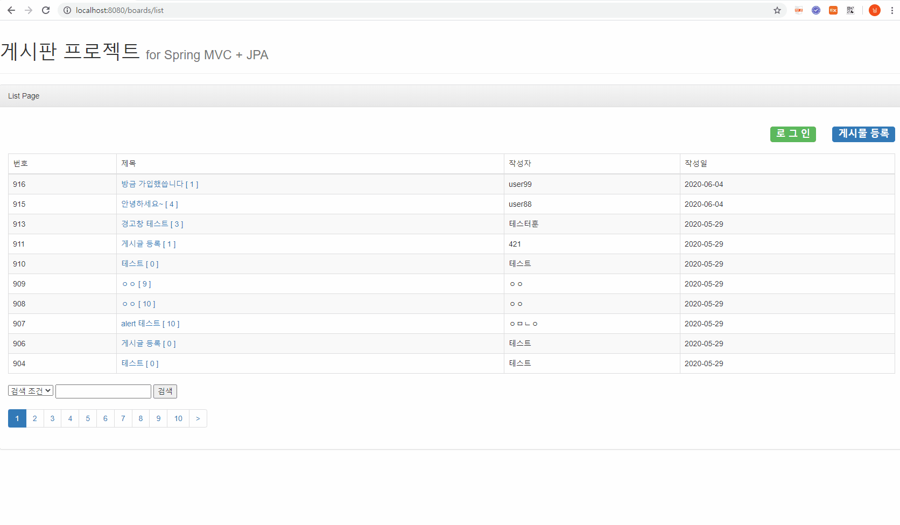
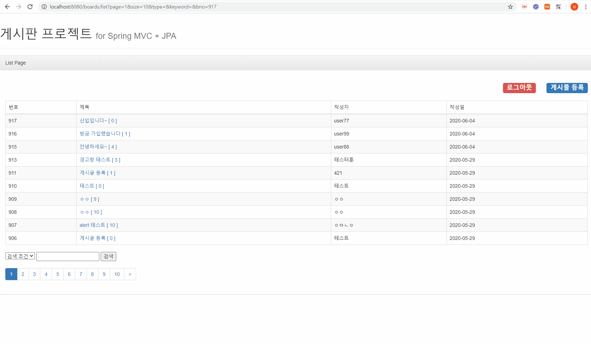

# JPA_Board
> 스프링 부트 2와 JPA, Thymeleaf를 이용한 게시판 프로젝트
---
## 게시글 조회 & 등록

---
## 댓글 조회 & 등록

--
## 개발 기간 
- 05.27 ~06.04
---
## 기술 스택
- Spring Boot 2
- Thymeleaf
- JPA
- Spring Security
- jQuery
- mySQL
---
## 느낀 점
- JPA를 사용하니 SQL문 작성없이도 간단한 DB 작업이 가능하기 때문에 빠른 개발에 적합하다.

- 테이블을 조인하는 것과 같은 복잡한 연산에는 JPA가 오히려 더욱 복잡하고 적합하지가 않았다.

- 단순한 CRUD 작업에는 JPA를 사용하여 개발하는 것이 좋으나, 통계처리, 테이블 조인과 같은 
  복잡한 작업에는 mybatis를 이용하는 편이 더욱 간편하고 쉬울 것 같다.

- Spring Boot를 사용하니 개발환경 구성이 훨씬 단순하고 시간도 적게 걸리는 점이 좋았다.

- Thymeleaf를 사용해서 View를 훨씬 더 간편하게 작성할 수 있었다. 반복문, 조건문 처리 기능이 제일 마음에 들었다.

- Spring Security를 두번째로 적용한 프로젝트이다 보니, Spring Security의 동작에 대해서 좀 더 자세히 공부할 수 있는 계기가 되었다.
